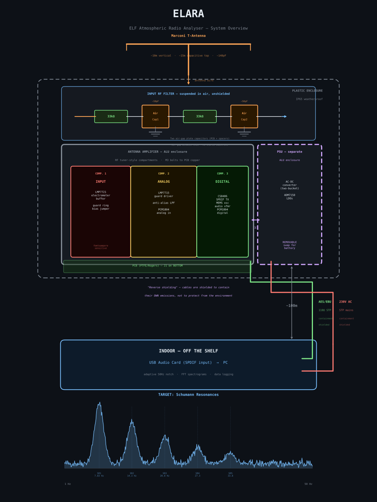
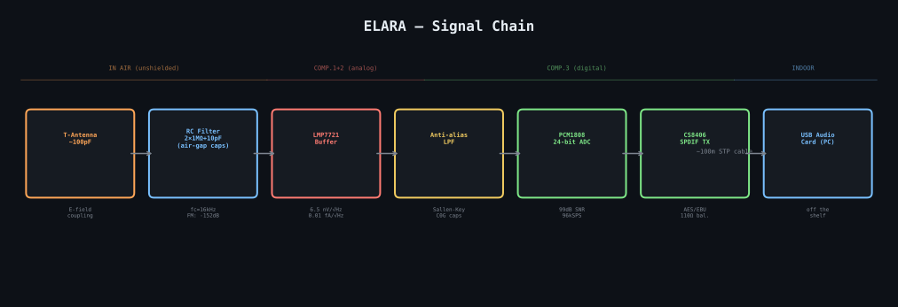
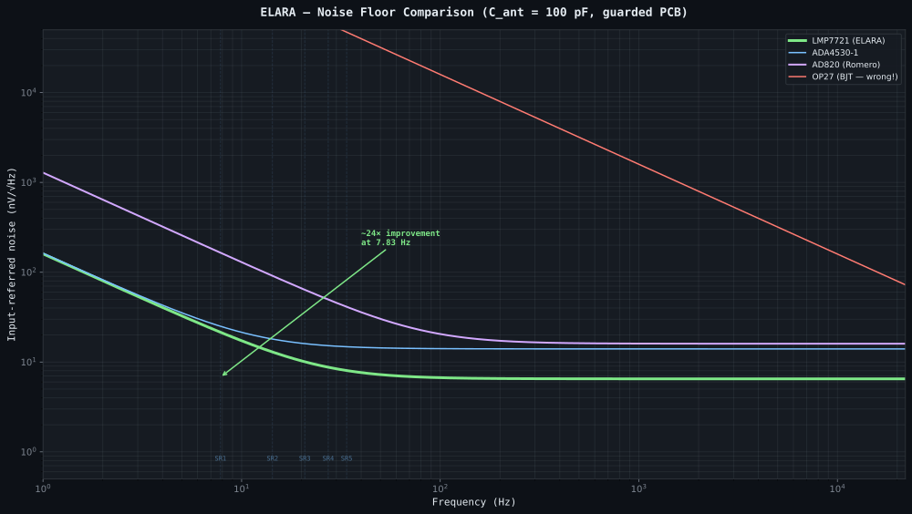
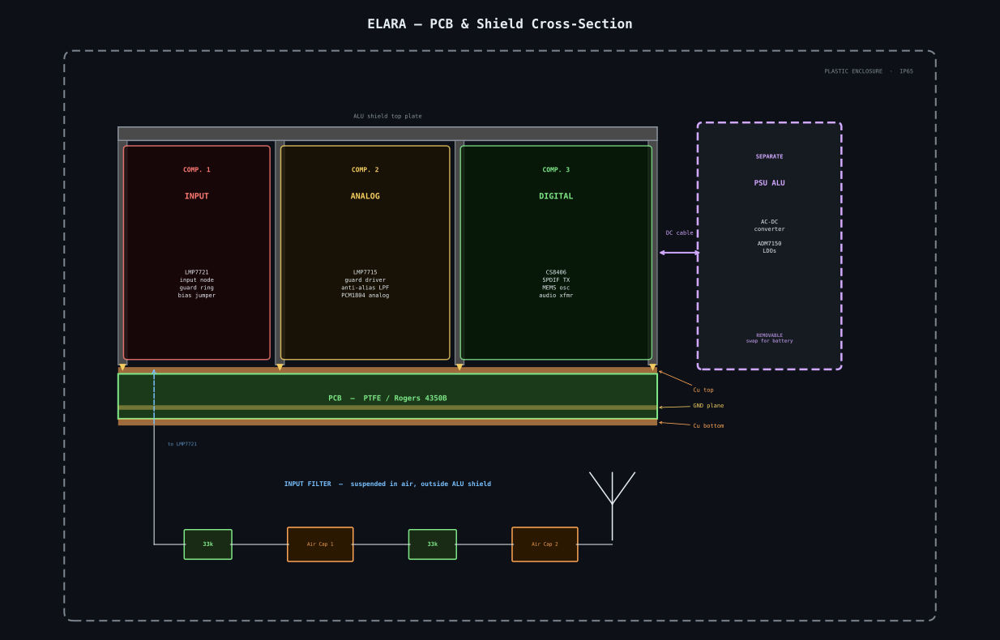

# ELARA — ELF/VLF Atmospheric Radio Analyser

A professional-grade electric-field receiver for natural ELF/VLF radio signals
(1 Hz -- 22 kHz), targeting Schumann resonance monitoring, sferic detection, and
whistler observation. Inspired by [Renato Romero's](http://www.vlf.it/cumiana/livedata.html)
electric-field receiver work, engineered for dramatically better noise performance
using modern electrometer-grade components.

## Architecture

The system is deliberately simplified: the only custom PCB is the outdoor antenna
unit. The indoor side is entirely off-the-shelf.

- **Marconi T-antenna** (~10 m vertical, ~15 m capacitive top, ~100 pF)
- **Outdoor unit** — single custom PCB inside a compartmentalised ALU EM shield,
  housed in a weatherproof plastic enclosure
- **Indoor unit** — any USB audio card with SPDIF input, connected to a PC

Both cables (AES/EBU digital audio + 230 V AC mains) use "reverse shielding" --
the shields contain the cables' own emissions to protect the antenna, not the
other way around.

## Signal Chain

| Stage | Component | Key Spec |
| --- | --- | --- |
| Input RF filter | 2-stage RC (air-gap plate capacitors) | fc ~16 kHz, FM rejection >150 dB |
| Electrometer buffer | LMP7721 | 6.5 nV/sqrt(Hz), 0.01 fA/sqrt(Hz) |
| Guard ring driver | LMP7715 | Drives active guard on all PCB layers |
| Anti-aliasing filter | Sallen-Key (C0G/NP0 caps only) | Matched to ADC sample rate |
| ADC | PCM1808 (24-bit delta-sigma, stereo) | 99 dB SNR, 48/64/96 kSPS (DIP switch) |
| Digital output | CS8406 SPDIF TX + audio transformers | AES/EBU 110 ohm + S/PDIF coax 75 ohm |
| Power supply | 9V DC -> ADM7150 LDOs (5V + 3.3V) | 1.6 uV RMS noise |

## Noise Performance

At the 1st Schumann resonance (7.83 Hz) with a 100 pF antenna:

| | ELARA (LMP7721) | Romero LNVA (AD820) |
| --- | --- | --- |
| Total input-referred noise | ~6.8 nV/sqrt(Hz) | ~163 nV/sqrt(Hz) |
| **Improvement** | **~24x voltage, ~575x power** | |

The LMP7721 is so quiet that PCB leakage current becomes the dominant noise
source -- making guard ring topology and substrate material selection critical.

## Mechanical Design

The outdoor unit uses RF tuner-style compartmentalisation inside an aluminium
shield enclosure:

1. **Compartment 1 (INPUT)** -- LMP7721 input node, guard ring, bias jumper.
   Femtoampere-sensitive, completely isolated from output and digital sections.
2. **Compartment 2 (ANALOG)** -- LMP7715 guard driver, anti-aliasing filter,
   PCM1808 analog input.
3. **Compartment 3 (DIGITAL)** -- CS8406 SPDIF transmitter, crystal oscillator,
   audio transformer. Digital noise quarantined here.

The power supply sits in a **separate removable ALU enclosure** (swappable for a
battery for lowest-noise operation).

Antenna connector (J1) is on the **PCB bottom** -- the ground plane provides an
additional shield between the input trace and digital sections above.

## No Input Protection -- By Design

There is deliberately no ESD or overvoltage protection on the antenna input. Any
protection component would introduce leakage currents that destroy the
femtoampere-level noise floor. Protection and electrometer-grade sensitivity are
fundamentally incompatible.

**Disconnect the antenna during thunderstorms.**

## Target Specifications

| Parameter | Value |
| --- | --- |
| Frequency range | 1 Hz -- 22 kHz |
| Input noise floor @ 7.83 Hz | < 7 nV/sqrt(Hz) |
| ADC dynamic range | 99 dB (PCM1808) |
| ADC resolution | 24-bit |
| Sample rate | 48 / 64 / 96 kSPS (DIP switch selectable) |
| Digital output | AES/EBU (110 ohm STP) + S/PDIF coax (75 ohm RCA) |
| Cable length | Up to 100 m (AES/EBU) |
| Mains rejection (software) | > 60 dB adaptive |
| Power (outdoor unit) | 230 V AC mains, locally regulated |
| Outdoor enclosure | IP65 plastic + ALU EM shield |

## Project Status

Early design phase on the `ai-augmented-design` branch. See
[PLAN.md](PLAN.md) for the full design document.

## Toolchain

| Tool | Purpose |
| --- | --- |
| KiCad | Schematic, PCB layout, component libraries |
| CadQuery (Python) | 3D models (STEP) for components and enclosure |
| FreeCAD + StepUp | Mechanical review, measurement, ECAD-MCAD sync |
| ngspice | Analog circuit simulation (noise analysis) |
| Python + numpy/scipy | Noise modelling, DSP, spectrograms |
| GCC/ARM | Firmware (if MCU added in future revision) |

## Licence

This project is licensed under the **CERN Open Hardware Licence v2 -- Weakly
Reciprocal (CERN-OHL-W-2.0)**.

See [LICENCE](./LICENCE) for full terms.

Copyright 2025 [MatejGomboc](https://github.com/MatejGomboc/ELF-Schumann-Resonance-Receiver)
