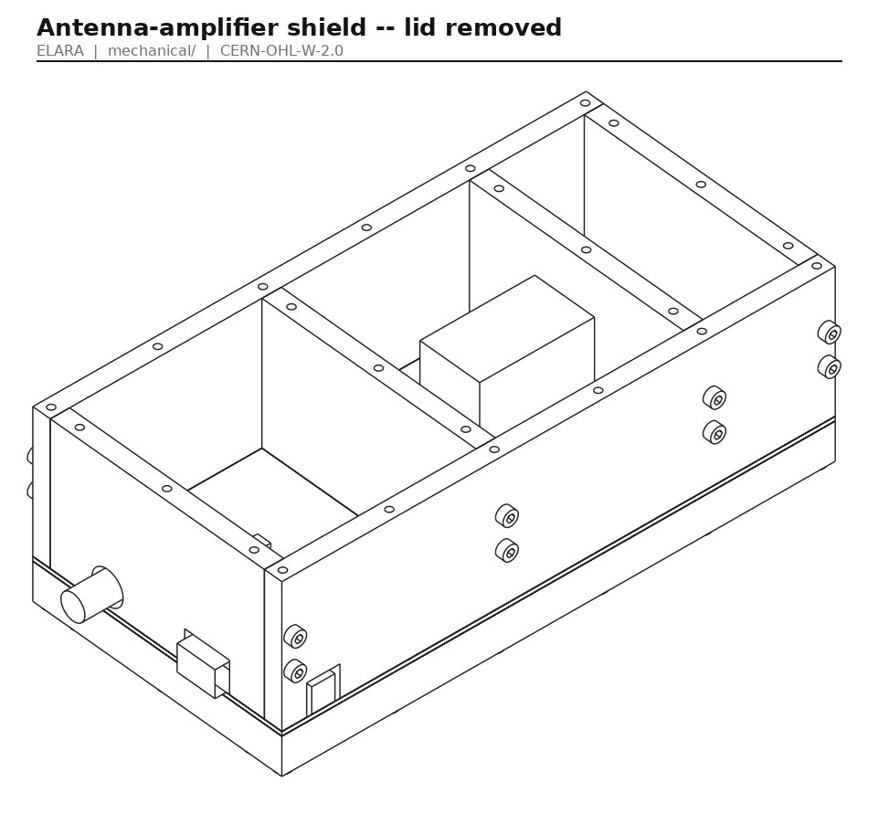
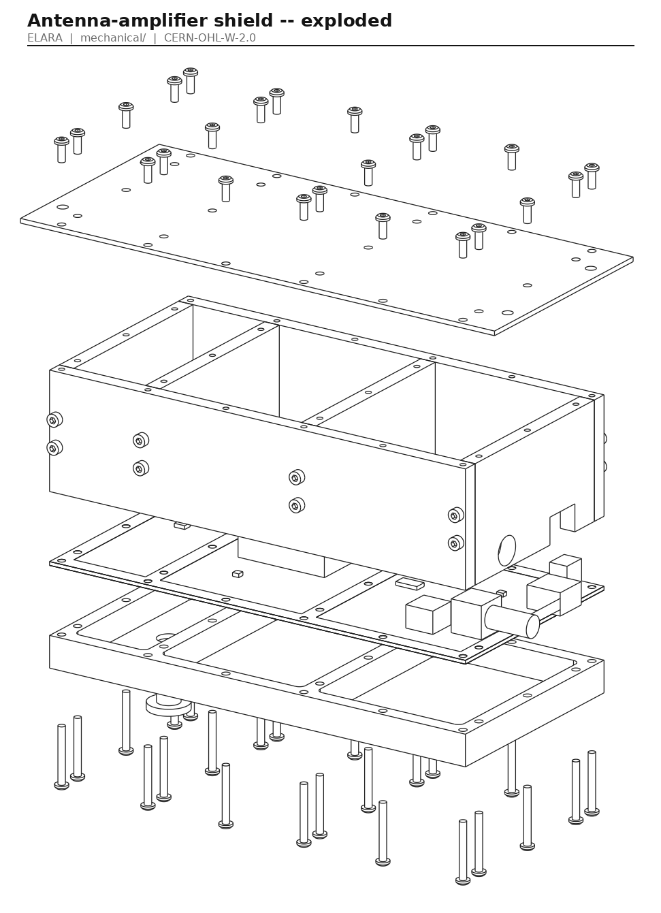
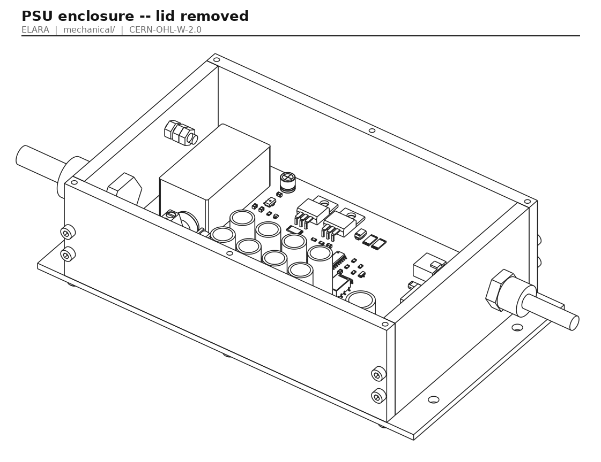
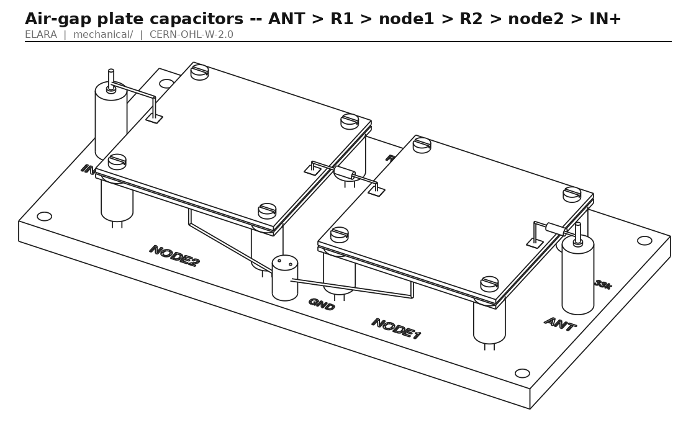
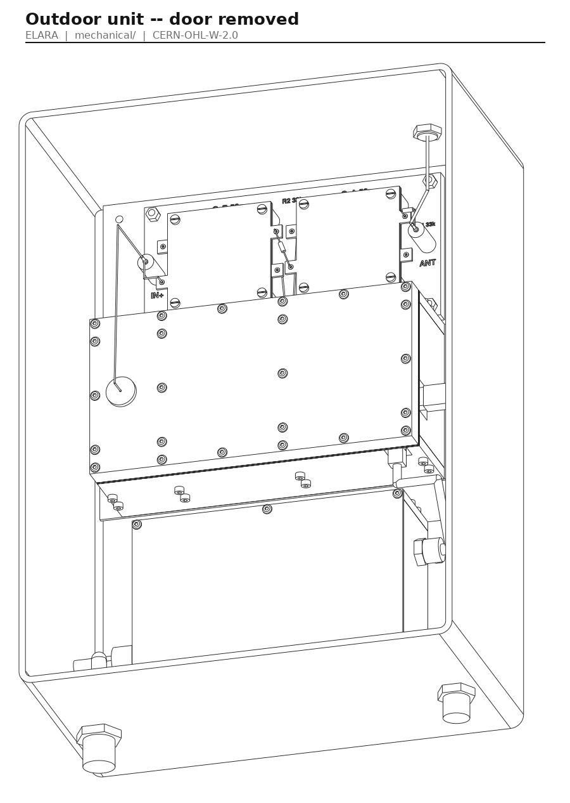
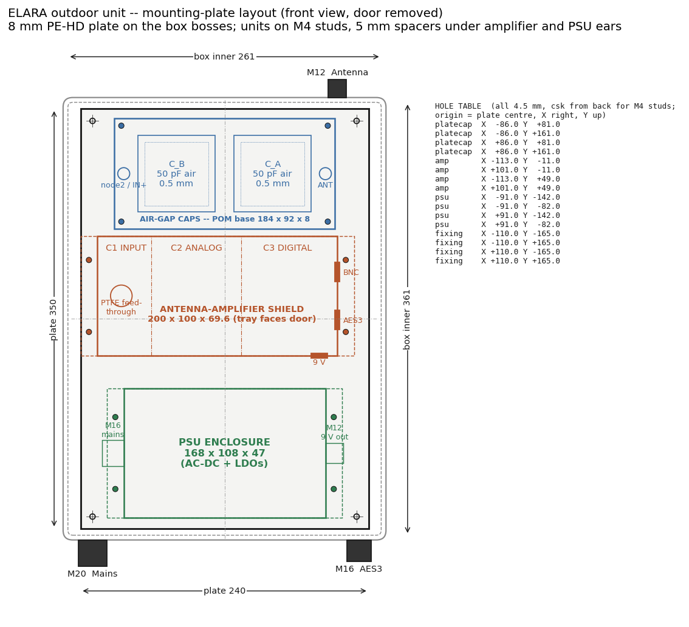

<!-- SPDX-License-Identifier: CERN-OHL-W-2.0 -->

# ELARA -- mechanical design

This directory holds the enclosures and mechanical parts of the ELARA
outdoor unit. The models are parametric CadQuery scripts. Every dimension
lives in [`params.py`](params.py), which is the single source of truth.
Running one command rebuilds every STEP model, the DXF flat patterns and the
preview renders:

```bash
.venv/bin/python mechanical/build_all.py            # ~80 s, includes a solid-body clash check
.venv/bin/python mechanical/build_all.py --no-clash # faster
.venv/bin/python mechanical/params.py               # geometry sanity checks only
```

(On Windows, use `.venv/Scripts/python`.)

## Design language

The enclosures are **brutalist, but made with care**. They are raw or
bead-blasted aluminium with flat faces and crisp orthogonal edges. Every
fastener is exposed and ISO-standard (A2 button heads and socket caps). The
only radii are the ones a tool leaves behind: the 3 mm end-mill radius in the
tray pockets. The parts are designed for a **local workshop**. They start
from stock flat bar and plate, and the work is sawing, facing, drilling,
tapping and one simple pocketing job. Nothing is welded, cast or bent.



## Coordinate conventions

* **PCB data in `params.py` uses KiCad coordinates.** The origin is the
  board's top-left corner, x points right and **y points down**.
* **CadQuery models of the amplifier convert with `X = x`, `Y = -y`**
  (`params.kicad_to_cq`). Z = 0 is the top surface of the PCB. The walls
  grow in +Z, and the PCB and the tray lie in -Z.
* **The outdoor-unit assembly** (`outer_box.py` and `full_assembly.py`)
  puts its origin at the centre of the box's inner floor. X points right,
  **Y points up** (the box is wall-mounted with the antenna gland on top),
  and Z points out of the wall towards the door. The amplifier shield is
  mounted **lid-down**, rotated 180° about X. So in the front view, KiCad
  y = 0 (the 9 V header edge) points down towards the PSU. The tray, with
  the PTFE feed-through, faces the door.

## Files

| File | Purpose |
| --- | --- |
| `params.py` | All dimensions, the hole list, cut-outs, layout, and `check()` sanity tests |
| `common.py` | Fastener models, STEP/DXF export, SVG to PNG renderer |
| `amp_frame.py` | 6 wall bars of the amplifier shield |
| `amp_lid.py` | 2 mm lid with mounting ears (plus DXF) |
| `amp_tray.py` | Pocket-milled bottom tray and the PTFE input feed-through bush |
| `amp_pcb.py` | Placeholder model of the amplifier PCB (holes, GND strips, tall parts, connectors) |
| `amp_assembly.py` | Shield assembly, lid-off, exploded and underside renders |
| `psu_box.py` | PSU enclosure: 4 bars, base, lid, glands, PE stud (plus DXF) |
| `platecap.py` | Air-gap plate capacitor assembly |
| `outer_box.py` | Generic IP66 box, mounting plate (plus DXF), glands, studs, placement |
| `full_assembly.py` | Everything in place, cable runs, clash check, box renders |
| `layout_drawing.py` | Dimensioned 2D mounting-plate layout and hole table |
| `build_all.py` | Regenerates all of the above |
| `step/` | STEP output: every part, every sub-assembly, and `elara_outdoor_unit_full.step` |
| `dxf/` | Flat patterns: amplifier lid, PSU base and lid, mounting plate |
| `renders/` | SVG line renders plus PNG versions (`rsvg-convert`) |

## 1. Antenna-amplifier shield ("tuner style")



### Geometry (KiCad coordinates)

* PCB: 200.0 x 100.0 x 1.6 mm.
* Exposed GND strips, 7 mm wide on both faces: a perimeter strip, and two
  internal strips centred on x = 45.0 and x = 120.0.
* **Walls are 7 mm thick**, the same width as the strips. This matches the
  compartment inner faces:
  C1 INPUT x 7..41.5, C2 ANALOG x 48.5..116.5, C3 DIGITAL x 123.5..193,
  all running y 7..93.
* **24 M3 holes** (3.2 mm in the PCB):
  * top and bottom rows (y = 3.5 and 96.5): x = 3.5, 45, 82.5, 120, 158, 196.5
  * left and right columns (x = 3.5 and 196.5): y = 15, 50, 85
  * internal walls (x = 45 and 120): y = 15, 50, 85
* Top frame: 52 mm above the PCB top. The tallest part is the 100 µF film
  capacitor at about 49 mm. The lid is 2 mm, so the overall height is
  14 + 1.6 + 52 + 2 = **69.6 mm**, plus the screw heads.
* Bottom tray: 12 mm clear depth under the PCB, a 2 mm floor, and the same
  footprint as the frame.
* Connector cut-outs, all milled into the bottom of the wall bars:

| Connector | Edge | Centre | Cut-out |
| --- | --- | --- | --- |
| 9 V Micro-Fit 3.0 R/A | top (y = 0) | x = 185 | 14 wide x 12 high, from the PCB surface |
| AES3 3-pole 5.08 mm terminal block | right (x = 200) | y = 30 | 18 wide x 12 high |
| BNC R/A (S/PDIF coax) | right (x = 200) | y = 70 | 16 wide x 14 high notch, from the PCB surface (barrel centre 7.5 above the PCB) |

* Signals pass between compartments on the inner PCB layers under the walls,
  so the walls have no holes.
* Mass: frame 710 g, tray 270 g, lid 120 g, so about **1.1 kg of
  aluminium**.

### Parts list

| # | Part | Qty | Material and stock | How it is made |
| --- | --- | --- | --- | --- |
| A1 | Long wall bar 200 x 7 x 52 | 2 | EN AW-6082 T6 flat bar 60 x 8 | Saw, then fly-cut or face to 52 x 7. Drill and tap 6 x M3 from each end face (12 deep bottom, 10 deep top). Drill 8 x 3.4 mm cross-holes (4 joint positions, at z = 20 and 32). Mill the 9 V notch (top bar only). |
| A2 | End wall bar 86 x 7 x 52 | 2 | same | Same as A1 (3 vertical taps). Tap 2 x M3 x 12 into each end. The right bar gets the AES3 notch and the BNC notch. |
| A3 | Internal wall bar 86 x 7 x 52 | 2 | same | Same as A2, without cut-outs |
| A4 | Lid 228 x 100 x 2 | 1 | EN AW-5754 H22 or 6082 sheet | Waterjet or laser from `dxf/amp_lid.dxf`, or mark out and drill: 24 x Ø3.4 and 4 x Ø4.5 in the ears |
| A5 | Bottom tray 200 x 100 x 14 | 1 | EN AW-6082 T651 plate, 15 mm | Face to 14 mm. Pocket-mill 3 pockets 12 deep with a Ø6 end mill (R3 corners). Drill 24 x Ø3.4 and one Ø10 hole. |
| A6 | PTFE feed-through bush | 1 | PTFE rod Ø20 | Lathe: Ø18 x 3 flange, Ø10 x 10 spigot, Ø1.2 bore |
| A7 | M3x25 ISO 7380 button, A2 | 24 | -- | Tray to PCB to wall bottoms (9.4 mm thread engagement) |
| A8 | M3x8 ISO 7380 button, A2 | 24 | -- | Lid to wall tops |
| A9 | M3x16 DIN 912 socket cap, A2 | 16 | -- | Frame corner and tee joints |

*Manual-shop alternative for A5 (no CNC):* build the tray from 12 x 7 bars
in the same layout as the top frame, screwed onto a 2 mm floor plate. The
hole pattern is identical.

*Stock-only alternative for A1 to A3:* 8 mm bars can be used unmilled if the
perimeter bars overhang the board edge by 1 mm. The internal walls should
stay at 7 mm so they sit only on the 7 mm GND strips.

Finish: bead-blast (glass bead, fine) after machining, then optionally clear
chromate conversion (Alodine 1200 / SurTec 650). **Do not anodise.**
Anodising insulates the contact faces against the GND strips.

### Assembly order

1. Join the six bars with the 16 socket caps on a flat surface plate. Check
   that the bottom face is flat, and lap it on abrasive paper on glass if
   needed. The bottom face is the RF seal against the GND strip.
2. Solder and wash the PCB. Keep the GND strips free of solder mask and
   flux.
3. Fit the PTFE bush into the tray from outside, flange out.
4. Lay the frame upside down, place the PCB (component side down) into it,
   then place the tray. Insert the 24 M3x25 screws through the tray and
   tighten them crosswise to about 0.8 N·m.
5. Fit the lid with 24 M3x8 screws. The lid is also the mounting face, so it
   goes on before the shield is mounted in the outer box.
6. Service access is from the tray side. Undo the 24 tray screws and the
   board lifts out, while the lid and frame stay on the mounting plate.

## 2. PSU enclosure (separate, removable)



The generic design uses the same construction as the amplifier shield, but
**stock sizes only**. The walls are **50 x 6 mm flat bar**, so the inner
height is 50 mm with no milling. That leaves about 38 mm above the PCB for the
10 x 30 mm EDLC cells, C16 and the LM317 heatsinks.

* Inner size: 156 x 96 x 50 mm, which is the 150 x 90 PCB plus 3 mm all
  round. Outer size is 168 x 108 x 55 mm, and 196 mm long including the
  base ears.
* PCB on 4 x M3x10 hex standoffs. Holes are 4 mm in from each corner.
* M16 mains gland at the left short end. The M12 gland for the 2-pin
  Micro-Fit output cable is at the right short end. Both are centred
  26 mm above the floor so the internal locknut clears the PCB.
* **PE stud**: M4 button head from below through the 3 mm base, with a
  serrated washer, nut, ring terminal and lock nut. It sits 20/20 mm in from
  the inner corner at the mains end.
* Mass: about 700 g of aluminium.

| # | Part | Qty | Material and stock | How it is made |
| --- | --- | --- | --- | --- |
| P1 | Long bar 168 x 6 x 50 | 2 | 6060/6082 flat bar 50 x 6 | Saw to length. Tap 3 x M3 in each edge. Drill 2 x Ø3.4 cross-holes at each end. |
| P2 | Short bar 96 x 6 x 50 | 2 | same | Tap 2 x M3 x 10 into each end. Drill Ø16.2 (mains end) or Ø12.2 (output end). |
| P3 | Base 196 x 108 x 3 | 1 | 5754 / 6082 sheet | From `dxf/psu_base.dxf`: 6 x Ø3.4, 4 x Ø3.4 (standoffs), 1 x Ø4.5 (PE), 4 x Ø4.5 (ears) |
| P4 | Lid 168 x 108 x 2 | 1 | same | From `dxf/psu_lid.dxf` |
| P5 | Cable glands M16 and M12, IP68, nylon | 1 + 1 | e.g. Lapp SKINTOP ST-M, Hummel HSK-K | -- |
| P6 | Fasteners | -- | A2 | 12 x M3x8 button, 8 x M3x12 socket, 4 x M3x10 F-F hex standoff, 8 x M3x6 button, M4x16 button, 2 x M4 nut, serrated washer |

**Commercial alternative: Hammond 1590E die-cast aluminium.** It measures
187.5 x 119.5 x 82 mm outside, about €25–35. The inner cavity (about
181 x 113 at the floor, with draft) takes the 150 x 90 PCB and leaves
height to spare. Check the corner lid-screw bosses against the PCB corners:
the 4 mm-inset holes clear them on the drawings, but measure the real part.
The standoff, PE stud and gland positions carry over unchanged. Two
alternatives with a similar footprint are the Hammond 1550-series and
Takachi TD-series die-cast boxes. The generic bar-built box is cheaper if you
have the saw and taps, and it matches the amplifier shield visually.

## 3. Air-gap plate capacitor assembly (PLAN §3.0)



```text
ANT --R1 33k-- node1 --R2 33k-- node2 --(flying lead via PTFE bush)--> J1 / LMP7721 IN+
                 |                |
               C_A 50 pF        C_B 50 pF     air, 0.5 mm, 2 x 64 x 64 FR4 each
                 |                |
                GND              GND  -> GND post -> amplifier tray
```

* Each capacitor is two 64 x 64 x 1.6 FR4 plates, copper facing copper. The
  lower plate (copper up) is GND. The upper plate (copper down) is the node,
  and a via brings its copper to 4 x 4 mm pads on its outer face at the ±X
  edges. The resistors are air-wired pad to pad. The lower plate brings GND
  to a pad on its underside at the front edge.
* The gap is **0.5 mm**. It is set by PTFE washers (Ø6 / Ø3.2 x 0.5,
  punched from 0.5 mm skived PTFE sheet) on 4 x M3x25 nylon cheese-head
  screws at (5, 5) from each corner, plus one loose Ø6 x 0.5 PTFE disc at
  the centre.
* Each capacitor stands on 4 PTFE standoffs (Ø10 x 15, from PTFE rod,
  Ø3.2 bore). The nylon screws thread into M3 holes tapped in the **8 mm
  POM-C base** (184 x 92). The two capacitors are 16 mm apart, and nothing
  but air and R2 joins node1 to node2.
* Two PTFE terminal posts (Ø10 x 24) carry turret pins: ANT at +X and
  node2 / IN+ at -X. A metal GND post sits at the front centre. The base is
  engraved `ANT`, `NODE1`, `NODE2`, `IN+`, `GND`, `R1 33k`, `R2 33k`,
  `C_A 50p` and `C_B 50p`.
* The base fixes to the mounting plate on 4 x M4 studs, with no spacers.

**Copper geometry, which the PCB drawing needs to reflect.** The M3 holes
at (5, 5) with a 3.2 mm drill reach 6.6 mm from the edge. The 53.1 mm copper
square starts at 5.45 mm, so the holes cut into the copper corners. The model
therefore uses:

* **a copper relief R4.8 around each corner hole**, and
* **an isolated copper landing ring (Ø7) under each washer**, with no solder
  mask. The 0.5 mm washer then sets the copper-to-copper gap directly.
  Without the rings, the washers would sit on bare FR4, and the copper
  thickness plus the mask would shrink the gap by about 0.1 mm, raising C by
  about 20 %.

With these features, `params.plate_capacitance_pf()` gives **48.9 pF** for
bare copper. Solder mask on the inner faces (2 x 20 µm, εr ≈ 3.8) adds about
+6 %, giving about 52 pF. Both are well within what the filter tolerates:
fc moves by less than ±4 %. For exactly 50.0 pF on bare copper, enlarge the
square to 53.8 mm.

## 4. Outdoor enclosure and mounting plate





The generic model is a polycarbonate box with an inner size of
**261 (W) x 361 (H) x 144 (D) mm**, 4 mm walls and four 10 mm floor bosses.
Its outer size is about 269 x 369 x 152.

The **mounting plate is 240 x 350 x 8 mm PE-HD** (about 640 g).
Countersunk M4 studs are pressed in from the back. Each unit drops onto its
own four studs and is held by M4 nyloc or knurled nuts, so any unit can be
lifted out alone. The PSU can be swapped for a battery this way. The
amplifier and PSU ears sit on 5 mm spacers, and the capacitor base sits
directly on the plate. A non-conductive plate keeps stray capacitance at the
ANT node low. 3 mm aluminium also works if the ANT post is kept at least
20 mm above it; it adds about 2–3 pF, or about 0.2 dB of divider loss.
The DXF with every hole is `dxf/mounting_plate.dxf`, and the hole table is
on the layout drawing.

Layout, top to bottom:

1. **Air-gap capacitors**, directly under the M12 antenna gland (antenna
   wire to the ANT turret).
2. **Amplifier shield**, lid against the plate. The node2 lead runs from the
   IN+ turret, 12 mm clear above the tray face, to the PTFE bush under
   compartment 1. The AES3 terminal block exits on the right, and the 9 V
   Micro-Fit exits at the bottom edge with 25 mm clearance for the plug.
3. **PSU box**, M16 mains gland on the left and M12 DC-out on the right.

The glands in the outer box are M12 for the antenna (top), and M20 for
mains and M16 for AES3 (bottom). The solid-body clash check in
`full_assembly.clash_check()` passes with every cable run in place.

### Commercial candidates (inner dimensions checked against the layout)

| Box | Outer (mm) | Inner (mm) | Notes | Approx. price |
| --- | --- | --- | --- | --- |
| **Fibox ARCA 403015** (PC, IP66, IK10, 2-point lock) | 300 x 400 x 150 | 261 x 361.5 x 144 | Reference box; the generic model matches it. Optional Fibox mounting plate, or cut ours. | €100–150 |
| **Fibox ARCA 403021** | 300 x 400 x 210 | same plan, about 60 mm deeper | More room for cable bends and the BNC plug | €130–180 |
| **Hammond PCJ14126** (PC, hinged, IP66 / NEMA 4X) | about 14 x 12 x 6 in | 354 (H) x 309 (W) x 152 | Wider (more cable room). Trim the plate to 345 mm high. | US$150–220 |

Prices are rough 2025–26 distributor prices (DigiKey, Farnell, RS) and
vary by region. Use UV-stabilised polycarbonate or GRP. **Do not use a metal
box**, because the electric-field antenna has to see through it. Use IP68
nylon glands with the right clamping range for each cable (for example
Lapp SKINTOP MS-M).

## Full assembly and renders

* `step/elara_outdoor_unit_full.step` has everything in place with the door
  on. The assembly is coloured and named.
* Renders:
  * `renders/amp_shield_iso_lid_off.png`
  * `renders/amp_shield_exploded.png`
  * `renders/amp_shield_underside.png`
  * `renders/platecap_assembly.png`
  * `renders/psu_box_lid_off.png`
  * `renders/outer_box_layout_front.png`
  * `renders/outer_box_layout_iso.png`
  * `renders/mounting_plate_layout.png`

## Complete assembly order

1. Machine and bead-blast all aluminium parts. Press the M4 studs into the
   mounting plate.
2. Build the amplifier shield (section 1, steps 1–5).
3. Build the PSU box: bars, then base, standoffs, PCB, glands and PE stud,
   then the lid.
4. Build the plate capacitors: base, standoffs, lower plates, washers and
   centre discs, upper plates, nylon screws (finger-tight plus 1/8 turn,
   then check C with an LCR meter). Solder R1, R2, the node2 lead and the
   GND wires.
5. Fix the mounting plate in the outer box with 4 x M4 screws into the
   bosses. Fit the three glands.
6. Drop the amplifier (lid-down), the PSU and the capacitor base onto their
   studs and fit the nuts.
7. Wire the unit:
   * antenna wire to ANT
   * node2 lead through the PTFE bush to J1
   * GND wire from the GND post to the amplifier tray
   * DC cable from the PSU to the Micro-Fit
   * mains cable to the PSU (PE to the stud)
   * AES3 cable to the terminal block
8. Before closing the door, do the bias-jumper start-up (PLAN §3.0).

## Open points and notes for the PCB

* **Hole list: agreed and final.** There are 24 holes. The side columns use
  y = 15/50/85 so that no tapped hole lands in the AES3 cut-out
  (y 21..39) or the BNC notch (y 62..78). `params.check()` verifies
  this and every other hole/wall/cut-out relation.
* **Wall thickness is 7 mm, not 5 mm.** The requested compartment faces
  imply 7 mm walls. With 5 mm walls, a tapped M3 at 3.5 mm from the edge
  would break through the inner face (thread 2.0..5.0 in a 0..5 wall).
* **BNC notch.** The jack's mounting lugs reach 1.4 mm under the wall line,
  so the right-hand bar has a 16 x 14 mm notch down to the PCB there, not a
  round hole: the bar must not sit on the lug solder joints, and the BNC
  shell (the transformer-isolated S/PDIF return) must not touch the shield.
  The body sits inside C3, so the barrel must still project at least 13 mm
  past the body front for the bayonet to engage outside the wall. Choose the part to suit, or treat the BNC as a bench
  port. With the plug fitted, the right-hand clearance to the box wall is
  tight in the ARCA 403015 (use a R/A BNC plug, or the PCJ14126).
* **Plate capacitors.** Add the corner copper reliefs (R4.8) and the
  isolated landing rings to the 64 x 64 plate PCB (section 3).
* **9 V Micro-Fit at x = 185 on the y = 0 edge.** This points at the PSU in
  the chosen layout, which is good. The mated plug needs 25 mm, and the
  layout allows for it.
